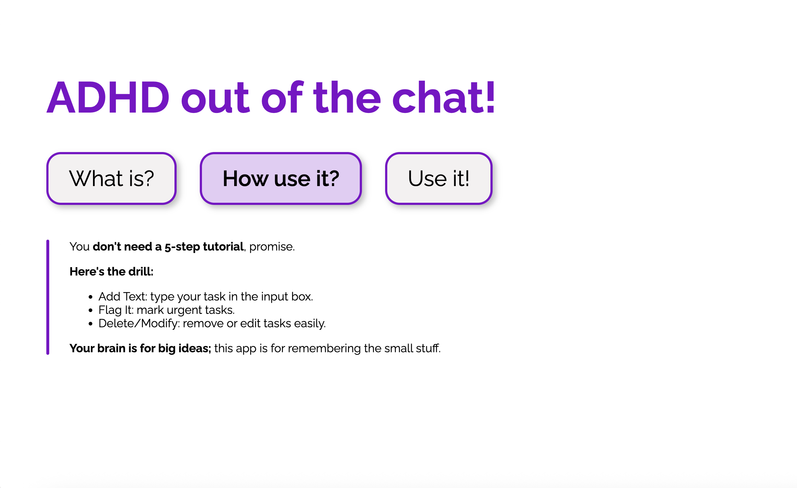
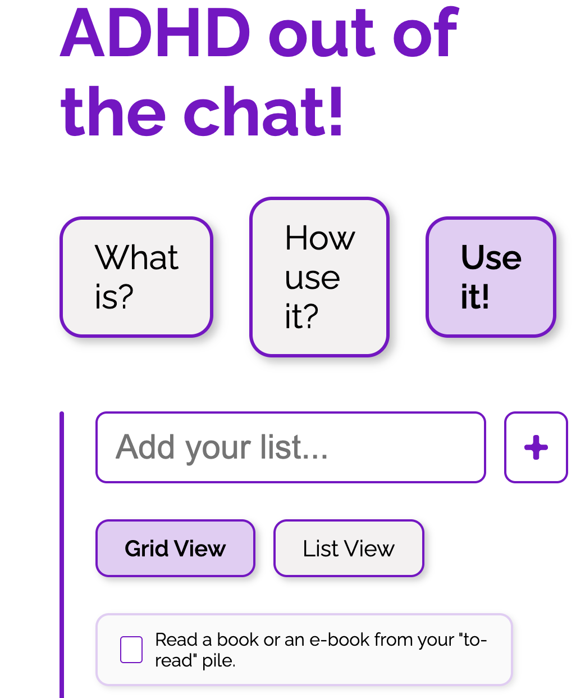
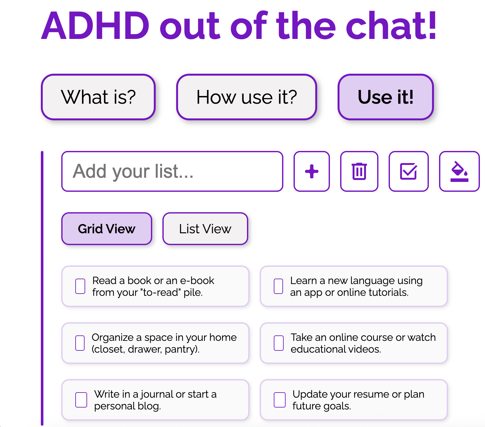
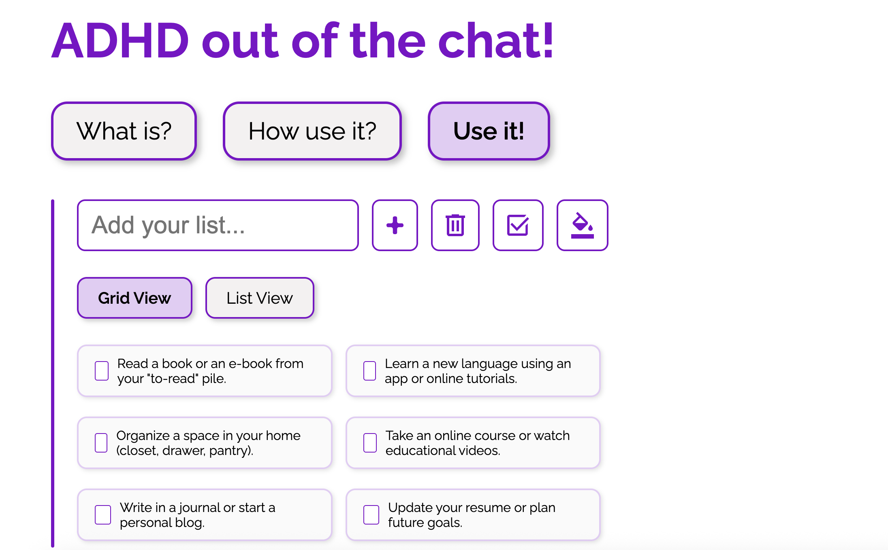
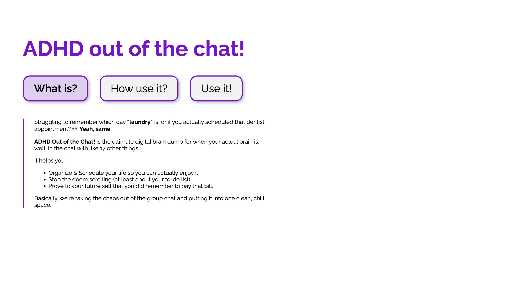

# ADHD Out of the Chat! - Micro App
## Brief 
Starting from the concept of a pinboard, implement a web page that:

- is responsive (properly layout for smartphone, tablet, and desktop)
- allows the user to add and remove elements
- allows the user to coustomize elements (i.e. colors, size)
- allows the switch between two views (at least)

## Screenshoot

# ADHD Out of the Chat!

**ADHD Out of the Chat!** is a small web app designed to help you manage daily tasks and ideas when your brain is overloaded.  
You can add, check, delete, and complete tasks — all in one clean, customizable space.  
Change colors, switch between grid/list views, and keep your mind focused.  

---

## Main Features

- Tab navigation between sections (“What is?”, “How use it?”, “Use it!”)  
- Add, delete, and mark tasks as done  
- Change theme color with a color picker  
- Switch between **Grid** and **List** view  
- Auto-deselect checkboxes when clicking outside the list  

---

## JavaScript Functions Overview

| Function / Event | Description |
|------------------|-------------|
| `DOMContentLoaded` | Initializes the app once the page is fully loaded. |
| `Tab Buttons Click` | Switches between content sections and updates the active tab. |
| `Add Item` | Adds a new to-do item using the text input field. |
| `Delete Checked` | Removes all checked items from the list. |
| `Mark as Done` | Moves checked tasks to the bottom, disables them, and marks them as done. |
| `Color Picker` | Lets you pick a custom main color that updates the app theme. |
| `Grid/List View Buttons` | Switch between grid and list layout. |
| `Outside Click Deselect` | Deselects all active checkboxes when clicking outside the list. |

---

## Technologies Used

- **HTML5** – Page structure  
- **CSS3** – Layout, colors, responsive design  
- **Vanilla JavaScript (ES6)** – Logic and interactivity  

---

## Customization
- Change the main color dynamically with the color picker (`--main-color`).  
- Toggle between **Grid View** and **List View** for your tasks.

---

## How to Run
Simply open `index.html` in any modern browser — no installation required.

---
