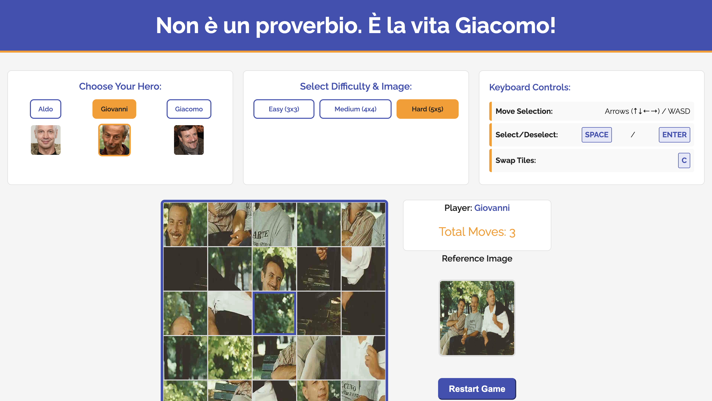

# Image puzzle challenge
## AGG

## Brief 

Choose a “mini-game” to rebuild with HTML, CSS and JavaScript. The requirements are:

- The webpage should be responsive
- Choose an avatar at the beginning of the game
- Keep track of the score of the player
- Use the keyboard to control the game (indicate what are the controls in the page). You can also use buttons (mouse), but also keyboard.
- Use some multimedia files (audio, video, …)
- Implement an “automatic restart” in the game (that is not done via the refresh of the page)

## Screenshoot

# Non è un proverbio. È la vita Giacomo! (AGG Puzzle Game)

**Non è un proverbio. È la vita Giacomo!**

**It's Not a Proverb. It's Life, Giacomo!** is a simple and fun sliding puzzle game inspired by the iconic jokes and characters of the Italian comedy trio **Aldo, Giovanni, and Giacomo** (AGG).

Select your hero, choose the difficulty (which determines the grid size), and reassemble the image in the fewest moves possible!

---

## Key Features

* **Character Selection:** Choose to play as **Aldo**, **Giovanni**, or **Giacomo**.
* **Adjustable Difficulty:** Three difficulty levels change the grid size:
    * **Easy (3x3)**
    * **Medium (4x4)**
    * **Hard (5x5)**
* **Intuitive Controls:** Play using the mouse (click) or the keyboard.
* **Move Counter:** Track your progress with a move counter.
* **Image Preview:** View the full reference image to help you solve the puzzle.
* **Visual and Sound Feedback:** Win notification with a celebratory message and sound.

---

## Game Controls (Keyboard)

The game supports keyboard controls for a faster and more accessible experience.

| Action | Alternative Keys | Description |
| :--- | :--- | :--- |
| **Move Selection** | ↑ ↓ ← → | Moves the tile highlight. |
| **Move Selection** | W A S D | Moves the tile highlight. |
| **Select/Deselect** | <kbd>SPACE</kbd> / <kbd>ENTER</kbd> | Selects a tile (first press) or swaps if a tile is already selected (second press). |
| **Swap Tiles** | <kbd>C</kbd> | Instantly swaps the **selected** tile with the **highlighted** tile. |

---

## JavaScript Functions Overview

| Function / Event | Description |
| :--- | :--- |
| `DOMContentLoaded` | Initializes the game on startup: sets the default character (`Aldo`) and starts the game with the default image (Easy 3x3). |
| `setTileStyle` | Calculates and applies the correct background position for each tile to display the right part of the image. |
| `renderPuzzle` | Draws the puzzle grid in HTML, updates the move counter, and sets the current tile highlight. |
| `shuffleArray` | Randomly shuffles the internal `puzzleArray` (the logical order of the tiles). |
| `swapTiles` | Executes the logical swap of two tiles in the array, increments the move counter, and calls `renderPuzzle` and `checkWin`. |
| `checkWin` | Checks if the tile array is in the correct order (`pieceIndex === positionIndex`) and, upon winning, shows the message and plays the sound. |
| `handleTileClick` | Handles mouse interaction: selects a tile or swaps tiles if two are selected. |
| `initializePuzzle` | Resets the game state, sets the new size and image, and populates the tile array with the initial order. |
| `startGame` | Initializes the puzzle, shuffles it, sets `isGameActive = true`, and updates the difficulty buttons and reference image. |
| `restartGame` | Restarts the puzzle with the current difficulty and image settings. |
| `selectCharacter` | Sets the current character name and restarts the game. |
| `handleKeyPress` | Handles keyboard input (movement, selection, swap) by updating the highlighted index or calling `swapTiles`. |

---

## Technologies Used

* **HTML5** – Page and game element structure.
* **CSS3** – Layout (Flexbox, Grid), styling, theming, and responsive design.
* **Vanilla JavaScript (ES6)** – All game logic, event handling, and DOM manipulation.

---

## How to Run

1.  Ensure all files (HTML, CSS, JavaScript, and the `assets/` folder with images) are in the same directory.
2.  Open the `index.html` file in your favorite browser. **No installation** or server is required.

---

## Files and Assets

* `index.html`: Main game structure.
* `style.css`: Styles, layout, and theme variables.
* `script.js`: Game logic.
* `assets/`: Contains character images (`Aldo.jpg`, `Giovanni.jpg`, `Giacomo.jpg`) and puzzle images (`facile.webp`, `medio.jpeg`, `difficile.jpg`).