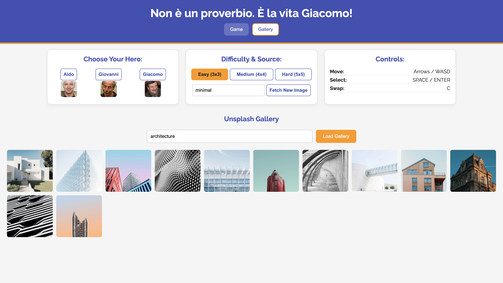
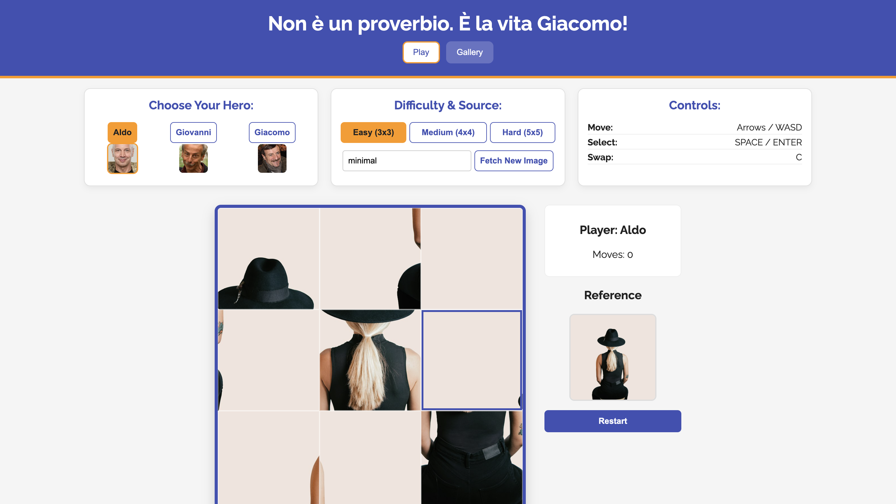
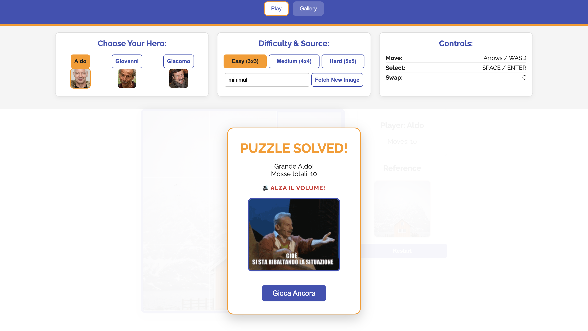
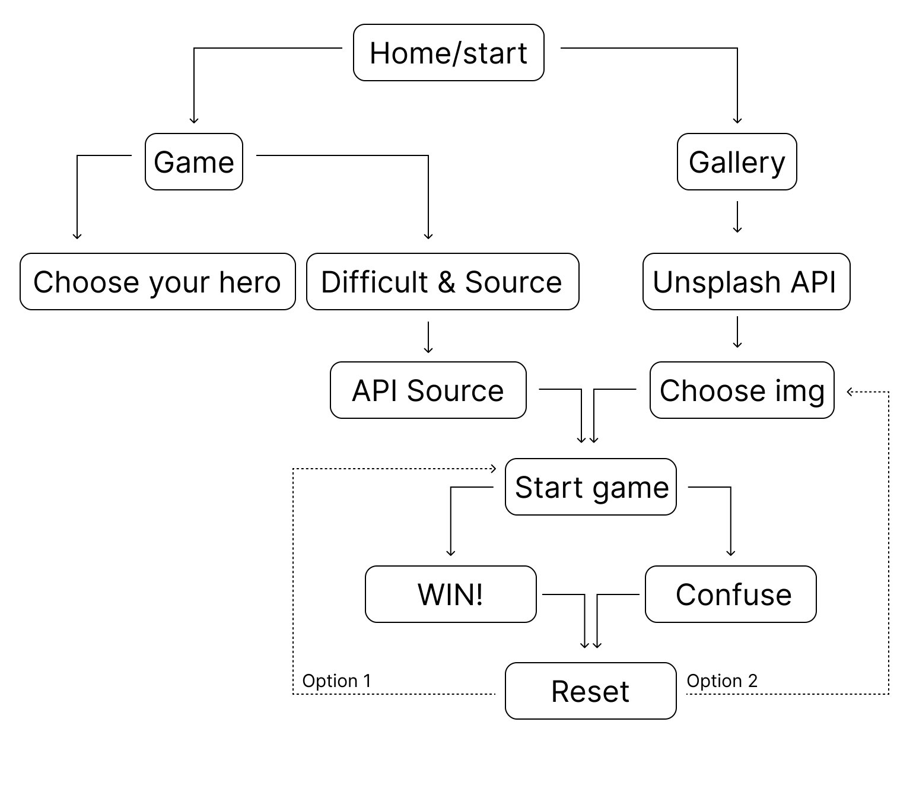

# AGG Puzzle Game — Unsplash Edition

## Brief
Upgrade the **Assignment 02** by adding the use of data coming from an external web API. For example, fetch contents (audio, images, video, text, metadata) from online archives, AI generated contents (chatGPT API), data (weather, realtime traffic data, environmental data).

Have a look at the lesson about the API:

[https://wind-submarine-3d4.notion.site/Lesson-5-200d516637bc811aba69e13b0ffe438f?pvs=74](https://www.notion.so/200d516637bc811aba69e13b0ffe438f?pvs=21)

The application **must** have those requirements:

- The webpage is responsive
- Use a web API (you choose which one best fists for your project) to load the data and display them in the webpage
- At least one multimedia file (for user feedback interactions, or content itself)
- Develop a navigation system that allows the user to navigate different sections with related content and functionalities

## Project Description
A responsive web puzzle game featuring Aldo, Giovanni, and Giacomo. Users select a character and difficulty (3x3 to 5x5), moving tiles to solve the image. It integrates the Unsplash API for dynamic imagery, keyboard/mouse controls, and multimedia feedback (random GIFs/Audio) upon victory.

* **UI Project:**

## Content and Data Sources
* **Images:** Fetched dynamically via [Unsplash API](https://unsplash.com/developers).
* **Local Assets:** Character avatars and Victory GIFs (meme clips from Aldo, Giovanni e Giacomo movies).
* **Audio:** Local MP3 files for victory feedback.
* **Libraries:** Tone.js (included via CDN).

## API Documentation
The application uses the **Unsplash API** to fetch random images or search results.
* **Endpoint used:** `https://api.unsplash.com/photos/random` and `https://api.unsplash.com/search/photos`.
* **Parameters:** `orientation=squarish`, `query=[user_input]`.
* **Authentication:** Access Key passed via URL parameters (client-side).

## Project Structure
* `index.html`: Main structure and UI layout.
* `style.css`: Styling, responsiveness, and visual feedback classes.
* `script.js`: Game logic, API handling, DOM manipulation, and event listeners.
* `assets/`: Folder containing local images and sound files.
* `docs/`: Contains screenshots and diagrams.

## How to Run
1.  Open `index.html` in a modern web browser.
2.  **Note:** To make the API work, insert a valid Unsplash Access Key in `script.js` at line 8: `const UNSPLASH_ACCESS_KEY = "YOUR_KEY";`.

### List of Functions

| Function Name | Arguments | Description | Returns |
| :--- | :--- | :--- | :--- |
| `fetchRandomUnsplashPhoto` | `query` (String) | Asynchronously calls the Unsplash API to fetch a random, squarish image based on the search query. | `Promise<Object \| null>` |
| `fetchGallery` | `query` (String), `perPage` (Number) | Asynchronously searches the Unsplash API to retrieve a list of images for the gallery. | `Promise<Array>` |
| `setTileStyle` | `tile`, `index`, `size`, `imageUrl` | Calculates and applies the correct CSS `background-position` and `background-size` to a specific tile element. | `void` |
| `renderPuzzle` | *none* | Clears the game container and dynamically creates tile elements based on the current `puzzleArray`. | `void` |
| `shuffleArray` | *none* | Randomizes the order of the numbers in the `puzzleArray` to scramble the puzzle pieces. | `void` |
| `swapTiles` | `index1` (Number), `index2` (Number) | Swaps two tiles in the array, increments the move counter, and triggers a re-render. Calls `checkWin`. | `void` |
| `checkWin` | *none* | Verifies if the puzzle is sorted. If true, triggers the victory sequence (Audio + Random GIF). | `void` |
| `handleTileClick` | `event` (Event) | Handles mouse interactions: selects a tile if none is active, or swaps if a second tile is clicked. | `void` |
| `initializePuzzle` | `imageUrl` (String), `size` (Number) | Resets internal variables (move count, array) and prepares the logical grid for a new game. | `void` |
| `startGame` | `url` (String \| null), `size` (Number \| null) | Main orchestrator: fetches image (if needed), preloads it, initializes logic, and renders the game. | `Promise<void>` |
| `restartGame` | *none* | Wrapper function that calls `startGame` using the currently active image and difficulty. | `void` |
| `selectCharacter` | `characterName` (String) | Updates the global character variable, highlights the UI button, and restarts the game. | `void` |
| `setupNavigation` | *none* | Initializes click listeners for the main navigation menu (switching between Play and Gallery). | `void` |
| `loadGallery` | *none* | Triggered by button click. Reads input, calls API, and renders clickable thumbnails. | `Promise<void>` |
| `moveHighlight` | `direction` (String) | Updates the visually highlighted tile index based on keyboard arrow inputs. | `void` |
| `handleKeyPress` | `event` (KeyboardEvent) | Global listener for keyboard controls (Arrows, WASD, Enter, Space, C). | `void` |

### Diagram flow
